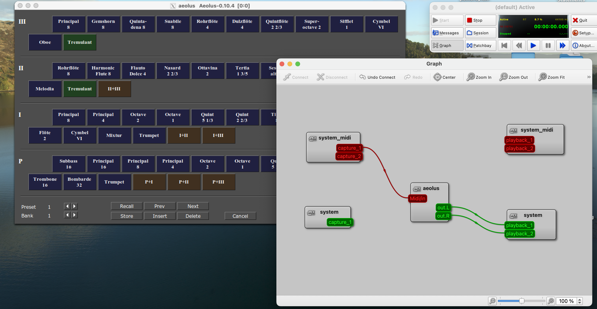

# Installation
You should be able to just run `./install-macOS.sh` but read that script if you want to do things by hand.

You probably want to just enable the JACK service:

    brew services start jack

# Running

Get the prerequisites running first:
- JACK
- XQuartz
- QJackCtl (optional)
- Stops folder (see README and https://kokkinizita.linuxaudio.org/linuxaudio/downloads/stops-0.4.0.tar.bz2)

## JACK
If you enabled the JACK service during installation, it should already be running.

## QJackCtl
Run `qjackctl` and click on Patchbay, then load the patchbay `doc/patchbay.xml`. This should automatically connect both MIDI and Audio when Aeolus starts up. You can make this patchbay persistent in the settings.

## XQuartz
Start `XQuartz` from Spotlight.

## Aeolus
`aeolus -h`
